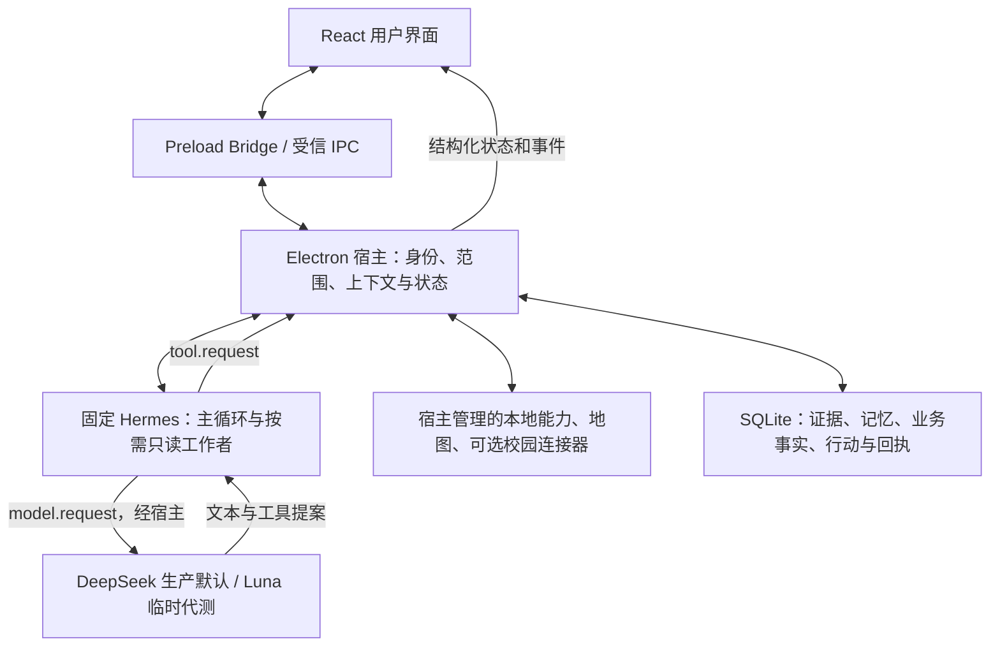

# 架构与事实归属

| 层 | 拥有的真相 | 明确不负责 |
|---|---|---|
| React：App、SettingsPanel、HarnessViews、map | 可见交互、草稿编辑、选择、显示状态 | 不持有模型 Key，不直接写 SQLite，不签发权限或判定官方事实 |
| preload / main IPC | 有限 Bridge 方法；main 校验 webContents、主 frame、可信 URL 与 Zod 输入 | 不把 renderer 参数直接当可信身份、任意文件路径或动作批准 |
| Harness / Coordinator / Policy | 一轮范围、参与上下文、调用预算、取消、模型/工具出口、来源版本 | 不用模型自报“成功”替代环境状态；不靠词面分类器裁剪主模型原话 |
| Context / Memory / Work / Repository | 证据与原文、条件断言、索引和水位；当前事项、目标、依赖和修复 | 记忆不是第二份官方成绩/课表；摘要不升级为原始事实 |
| Hermes 0.21.2 | 上游真实模型—工具—观察循环及独立只读工作者 | 不直接访问应用数据库、用户文件、密钥或任意 native shell；不成为第二套权限系统 |
| 模型传输 | 请求/流式协议、实际提供方身份、工具提案、用量、取消 | 模型不拥有权限、业务状态、执行回执；可提出不等于可执行 |
| Broker / Actions / Domains / Map | 能力 schema、执行与校验；事务 outbox、批准/attempt/receipt；领域原始状态和时间/路由计算 | 不把连接当委托、不把超时当失败、不把本机状态冒充外部状态 |

实际路径：`App.tsx` 调用 `window.zaichang.send` → `preload.ts` 的 `ipcRenderer.invoke('send')` → `main.ts` 校验 → `Harness.start` 先限制云端/数据使用，再进入 Coordinator/Context。`runtime/hermes.ts` 用私有 stdio 帧连接 `runtime/hermes/sidecar.py`；模型请求和工具请求回到宿主。工具经 `ToolRegistry` 和 Broker/各业务服务执行，来源、版本和真实回执再返回模型，宿主最终发布 `zaichang:event`。

Hermes 固定 commit 为 `d595e636c83aa0b9606d4e914e1140ae9c796897`，锁在 `runtime/hermes/lock.json`。安装器从上游取源码和 uv.lock，进行少量宿主适配，不复制另一份自建 conversation loop。

Luna 通过 App Server 完成账户认证，但实际业务循环仍是 Hermes。环回桥只转发宿主提供的完整消息与工具定义到固定模型端点；App Server 不执行业务工具。sidecar 内部保留 DeepSeek Chat Completions 方言兼容设置，实际模型身份另由宿主 `modelIdentity` 传递到请求和工作者回执，不能仅凭兼容常量反推模型。

图像以当前 user 消息的原生图像段进入模型；已有权限范围下的协议续接仅驻留有限内存链，来源/隐私版本变化后清除。SQLite 正文、逻辑隔离、外部备份与已发送内容的边界见根目录实施说明及 04；不存在绝对遗忘或全覆盖保证。
